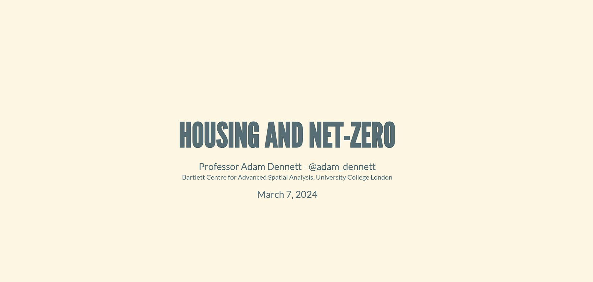

A presentation on housing stock energy performance and what the EPC data
can (and can't) tell us about routes to net zero.

[Open the slides →](https://adamdennett.github.io/EPC_Data_Analysis/HousingAndNetZero.html)
