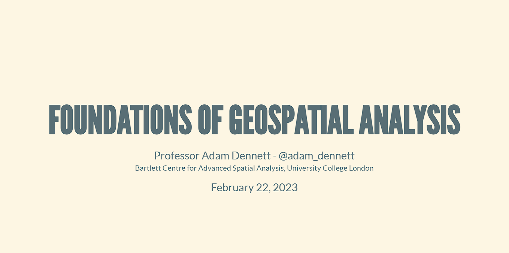

A presentation on the Foundations of Geospatial Analysis that I gave at the
[Carto Spatial Data Science Bootcamp](https://carto.com/spatial-data-science-bootcamp/)
in London on 22nd February 2023.

- [Open the presentation →](https://adamdennett.github.io/cartosdsbootcamp/FoundationsGeospatialPresentation.html)
- [Source code on GitHub](https://github.com/adamdennett/cartosdsbootcamp)
